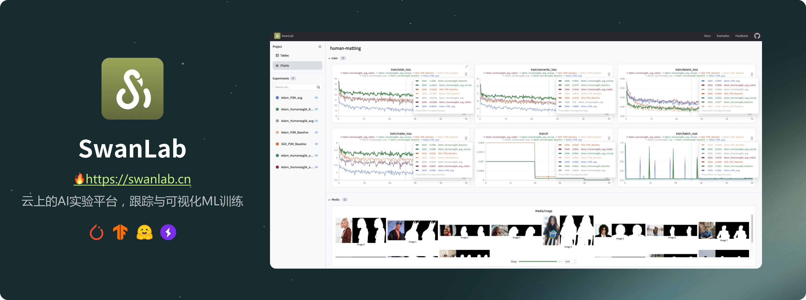

**👋 Hi here, I'm ZeYiLin(林泽毅 in Chinese)**

Now, I am a first-year Ph.D. student at [Xidian University](https://www.xidian.edu.cn/) , under the guidance of Prof. [Wu Jiaji](https://web.xidian.edu.cn/wujj/), and also a co-founder of [SwanHub](https://swanhub.co) and [SwanLab](https://github.com/SwanHubX/SwanLab). I am passionate about working in a full-stack capacity, with a love for **ML**, **UI&UX**, and **Product Management**. Currently, my focus is on building [@SwanLab](https://github.com/SwanHubX/SwanLab), aiming to create a new collaborative approach to AI research.

My Products：

| Product | Details       | Start Time|
| ------  | ------- | ---------------- |
| [🔥SwanLab](https://github.com/SwanHubX/SwanLab)   | A tool for your machine learning log tracking and experiment management. **🚀Continuing iteration.** | 2023.12 |
| [SwanHub](https://swanhub.co)     | 🤖A Machine Learning Open Source Community，**🚀Continuing iteration.**    | 2023.5 |
| HivisionIDPhotos   | **🔥1.2 million+ users**; WeChat mini program（Search "焕影一新"）; one-click production of ID photos based on CV; the code has been open-sourced by [HivisionIDPhotos](https://github.com/xiaolin199912/HivisionIDPhotos).   | 2021.5 |
| [SwanChain](https://swanchain.co)   | 🔧A drag-and-drop LLM Agent application editor. | 2023.9 |
 

**E-mail**: zeyi.lin@swanhub.co
